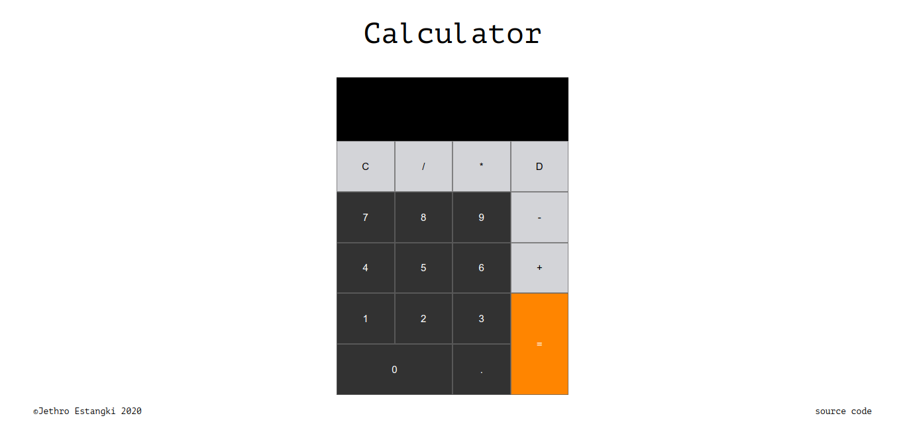

# JavaScript Calculator
An online calculator made with JavaScript, HTML, and CSS. 
From [The Odin Project's](https://www.theodinproject.com/) [curriculum](https://www.theodinproject.com/courses/web-development-101/lessons/calculator)

## To-do
* Make responsive
